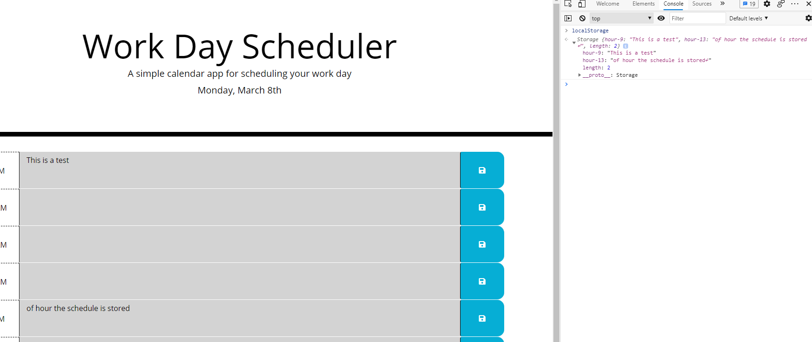

# Day Planner

 

## Description 

This project is a simple dayplanner that allows a user to track their day in hourly increments of time. Each hour of the work day allows for an entry and upon clicking the save button, it commits the activity to local storage. The Moment.js library is used to track the dates and times within the application.

## Table of Contents

* [Usage](#usage)
* [Contributing](#contributing)
* [License](#license)
    
## Usage 
    
*Instructions on how to run and use the program*
    
In order to use the app, you'll need to save the js, css and html files locally. Open the html file in a browser and simply add items to the hourly boxes by typing in the boxes. Click the save button next to the hour in order to save the entry to local storage.

    
## Contributing
    
*To make contributions to the app, please reach out to the following admin(s) for approval:*
Jonathan Baldree

## License
    
Licensed under the  License.

---
    
## Questions?
    
If you have any questions, you can reach out to me through the below GitHub site or send an email to me at: jon.baldree@gmail.com
   
GitHub: https://github.com/jbaldree
